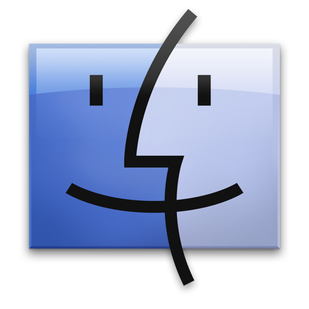

 <!-- res/icon/Dokun-logo_128x128.png -->


[](https://travis-ci.com/sidtheprince/dokun) [](https://opensource.org/licenses/MIT "Open Source")

`Dokun` is a video game engine framework written in [C++](https://en.wikipedia.org/wiki/C%2B%2B) with support
for the [Lua](https://www.lua.org/) language.

`version:`         `1.0.0`

```
author           Sid Lartey Doku
development date 2015-present
license          MIT
```

## Build requirements
> `Windows` [`mingw 4.8.4+`](http://www.mingw.org/)

> `All    ` [`cmake 2.8+  `](https://cmake.org/download/)</a>

 
# Building dokun
Read <a href="https://github.com/sidtheprince/dokun/blob/master/src/build.txt">src/build.txt</a> for more information on how to build dokun.
```sh
...
```

# Definitions
```sh
 DOKUN_DEBUG DOKUN_OPENGL DOKUN_VULKAN 
``` 

# Hello World (example)
```lua
-- Lua
require ("dokun")

WINDOW_MODE  = 0
FULL_SCREEN  = 1

window = Window:new()
window:create("Hello World", 800, 600, WINDOW_MODE)
window:show()

while window:is_open() do 
    window:update()
end
```
```cpp
// C++
#include <dokun.hpp>

int main()
{
    Window window;
    window.create("Hello World", 800, 600, 0);
    window.show();  
    
	while(window.is_open())
	{
		window.update();      
	}
	return 0;
}
```

# Supported External Libraries
|      Library name      |             License                  |         Used for                                      |
|------------------------|--------------------------------------|-------------------------------------------------------|
| `lua`                  | MIT                                  | scripting                                             |
| `libpng`               | zlib/libpng                          | image                                                 |
| zlib                   | zlib/libpng                          | extension                                             |
| libjpeg                | BSD                                  | image                                                 |
| giflib                 | MIT                                  | image                                                 |
| libtiff                | BSD                                  | image                                                 |
| `libogg`               | BSD                                  | container                                             |
| `libvorbis`            | BSD                                  | audio (codec)                                         |
| `libtheora`            | BSD                                  | video (codec)                                         |
| opus                   | BSD                                  | audio (codec)                                         |
| openal (soft)          | LGPL                                 | audio (playback)                                      |
| `freetype`             | FT license (BSD)                     | font                                                  |
| utf8                   | BSD                                  | unicode                                               |
| sqlite3                | public domain                        | data_serialization                                    |
| libxml2                | MIT                                  | data_serialization, model (COLLADA), image (SVG)      |
| box2d                  | zlib/libpng                          | physics                                               |
| bullet3                | zlib/libpng                          | physics                                               |
| `opengl`               | MIT                                  | graphics                                              |
| glew                   | BSD, MIT                             | extension                                             |
| vulkan                 | MIT                                  | graphics                                              |


## Powered by ##
<a href="https://www.lua.org/" target="blank"></a>
<a href="https://www.opengl.org/" target="_blank"></a>
<a href="https://www.khronos.org/vulkan/" target="_blank"></a>

`operating systems`

<a href="https://www.microsoft.com/en-us/windows" target="_blank"></img></a>         <a href="http://www.ubuntu.com/" target="_blank"></img></a>  
<!-- <a href="https://www.apple.com/osx/"></img></a>   <a href="https://www.android.com/"></img></a>  <a href="https://www.apple.com/ios/"></img></a>
-->

## Donations ##

`BTC:`
[`14VA6zJ46fdv4pagJEg4WNMYPiFn7RX1xS`](https://www.blockchain.com/btc/address/14VA6zJ46fdv4pagJEg4WNMYPiFn7RX1xS)

<a href="https://www.blockchain.com/btc/address/14VA6zJ46fdv4pagJEg4WNMYPiFn7RX1xS" target="_blank"></img></a>

